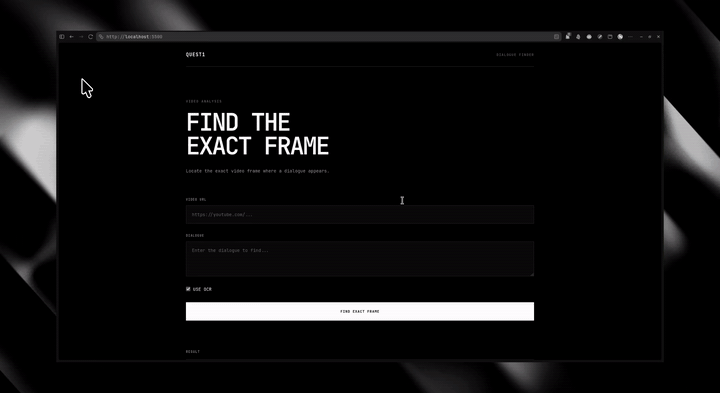

# Dialogue Finder

Find the exact video frame where a given dialogue appears.




## Overview

Dialogue Finder takes a public video URL and a target dialogue, processes the video automatically, and identifies the exact timestamp and frame where the dialogue occurs.

It returns:
- Matched dialogue text
- Start and end timestamps
- Exact frame number and frame timestamp
- Extracted frame image
- Video playback positioned at the detected timestamp

The system uses speech transcription (Whisper) to locate dialogue in the audio track and optionally uses visual OCR (PaddleOCR) to detect on-screen text and burned-in subtitles.

## How It Works

1. **Video Ingestion & Caching**: Extracts the stable video ID via `yt-dlp` and checks the database. If already processed, existing audio/frames/transcripts are reused immediately.
2. **Audio Extraction**: Extracts audio using FFmpeg.
3. **Speech Transcription**: Generates timestamped word-level transcriptions using `faster-whisper`.
4. **Dialogue Matching**: Performs fuzzy search across the transcript timeline to find the best match.
5. **Frame Extraction**: Uses OpenCV to seek and extract the precise frame image at the matched timestamp.
6. **Visual OCR (Optional)**: If OCR is enabled, scans video frames with PaddleOCR to verify on-screen dialogue or subtitles.
7. **Result Delivery**: Returns frame image, timestamps, and video stream to the web frontend.

## Tech Stack

- **Backend**: FastAPI, Python 3.14
- **Database & ORM**: PostgreSQL, SQLAlchemy, Alembic, psycopg3
- **Media & ML**:
  - `yt-dlp` (video extraction and download)
  - FFmpeg (audio extraction & stream normalization)
  - `faster-whisper` (speech-to-text with word-level timestamps)
  - OpenCV (frame extraction and image processing)
  - PaddleOCR (visual text detection and recognition in isolated Python 3.13 runtime)
- **Frontend**: Vanilla JavaScript, HTML5, CSS3
- **Package Management**: `uv`

## Project Structure

```text
quest/
├── backend/
│   ├── main.py                  # FastAPI application entrypoint
│   ├── db/
│   │   ├── database.py          # Database connection and session management
│   │   ├── models.py            # SQLAlchemy schema models (videos, transcripts, OCR, matches)
│   │   └── repository.py        # Database CRUD operations
│   ├── migrations/              # Alembic database migrations
│   ├── services/
│   │   ├── downloader.py        # yt-dlp downloading and format handling
│   │   ├── audio.py             # FFmpeg audio extraction
│   │   ├── transcription.py     # faster-whisper speech-to-text
│   │   ├── timeline.py          # Fuzzy dialogue searching on transcript
│   │   ├── frame.py             # OpenCV frame extraction
│   │   ├── dialogue.py          # Dialogue finding & OCR fallback coordinator
│   │   ├── ocr.py               # OCR orchestration
│   │   ├── ocr_worker.py        # Isolated PaddleOCR execution script
│   │   └── pipeline.py          # End-to-end ingestion pipeline
│   └── outputs/                 # Storage for downloaded videos, audio, and frames
├── frontend/
│   ├── index.html               # Main user interface
│   ├── app.js                   # Client-side API integration & video player logic
│   └── style.css                # Interface styling
├── setup.sh                     # Automated setup script (Linux / WSL)
├── run.sh                       # Application runner (Linux / WSL)
├── setup_mac.sh                 # Automated setup script (macOS)
└── run_mac.sh                   # Application runner (macOS)
```

## Setup

> [!IMPORTANT]
> **OS Support**: Official setup and run scripts are provided for **Linux** (`setup.sh`, `run.sh`) and **macOS** (`setup_mac.sh`, `run_mac.sh`). **Native Windows is not supported at this time** (Windows users must use WSL - Windows Subsystem for Linux).

### Prerequisites

* **Python 3.14** (Backend) & **Python 3.13** (OCR runtime - managed automatically via `uv` if not installed)
* **PostgreSQL**
* **FFmpeg**
* **uv** package manager

### Quick Start

#### Linux (or Windows via WSL)
1. Clone the repository:
   ```bash
   git clone https://github.com/Naveensivam03/Quest1.git
   cd quest
   ```

2. Run setup:
   ```bash
   ./setup.sh
   ```

3. Start application:
   ```bash
   ./run.sh
   ```

#### macOS
1. Clone the repository:
   ```bash
   git clone https://github.com/Naveensivam03/Quest1.git
   cd quest
   ```

2. Run macOS setup:
   ```bash
   ./setup_mac.sh
   ```

3. Start application on macOS:
   ```bash
   ./run_mac.sh
   ```

The application will be accessible at:
- **Frontend**: http://127.0.0.1:5500
- **Backend API**: http://127.0.0.1:8000 (Swagger docs at `/docs`)

## Usage

1. Open `http://127.0.0.1:5500` in your browser.
2. Enter a public video URL (e.g. YouTube, YouTube Shorts, ok.ru).
3. Enter the dialogue text you want to locate.
4. Toggle **OCR** if you want visual on-screen text verification.
5. Click **Find Dialogue**. The app displays the matching frame image, exact timestamp, and embedded video player.

## OCR Mode

- **Disabled (Default)**: Uses the speech-to-text transcription pipeline (`faster-whisper`). Fast and accurate for spoken dialogue.
- **Enabled**: Uses visual OCR (`PaddleOCR`) alongside transcription to locate or verify text shown visually on screen (such as silent title cards, text overlays, or subtitles).

## Documentation

Detailed architectural and design decisions can be found in:
- [`docs/APPROACH.md`](docs/APPROACH.md)
