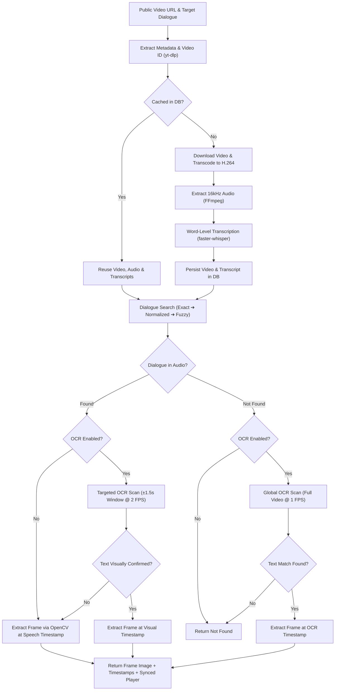
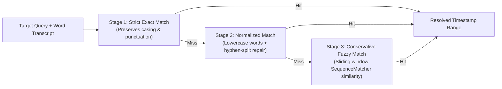
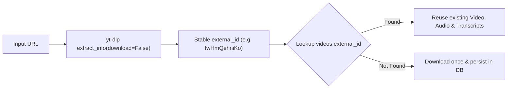

# Approach & System Design

This document details how I reasoned through the problem of locating the exact video frame where a given dialogue appears, why I built the system the way I did, and the trade-offs made along the way.

---

## 1. Understanding the Problem

The core requirement is straightforward on the surface: given a public video URL and a target dialogue query (e.g., *"My mind rebels at stagnation"*), automatically determine:
1. The start and end timestamps where the dialogue appears.
2. The exact video frame number and frame timestamp.
3. The extracted frame image.

Critically, the solution must run **end-to-end automatically**, without requiring any human operator to manually scrub or inspect the video.

---

## 2. The Core Ambiguity: Spoken vs. Visual Dialogue

When designing the system, the first question was: **Where does "dialogue" live in video?**

The prompt doesn't specify if dialogue is:
- **Spoken audio** (delivered by characters on the soundtrack).
- **Burned-in on-screen text** (subtitles, silent movie title cards, lower-thirds).
- Or a combination of both.

### The Computational Trade-off
- **Visual search across every frame** is expensive. A 10-minute video at 30 FPS has 18,000 frames. Running deep learning OCR on 18,000 frames takes minutes on a GPU and is practically unviable on CPU.
- **Audio speech transcription**, on the other hand, converts continuous sound into a compact sequence of timestamped words in seconds.

---

## 3. Initial Investigation

I inspected the provided sample video and confirmed that the target dialogue (*"My mind rebels at stagnation"*) is **spoken by Sherlock Holmes**, with no prominent visual title card.

This established my core strategy:
1. **Speech-first**: Use fast, word-level speech-to-text as the primary discovery mechanism.
2. **Targeted OCR as fallback & verification**: Use visual text recognition only when speech fails (e.g., silent videos, muted audio) or to pin down visual subtitle frames.

---

## 4. End-to-End System Flow



---

## 5. Pipeline Stages

The pipeline breaks down into focused, independent services:

1. **Ingestion & Normalization (`services/downloader.py`)**:
   - Extracts the canonical video ID via `yt-dlp` metadata before deciding whether to download.
   - Downloads streams (`bv*+ba/best`) and checks codec with `ffprobe`.
   - If encoded in AV1/VP9, normalizes to standard H.264/AAC via `ffmpeg` to prevent frame-seek inaccuracies and browser playback glitches.
2. **Audio Extraction (`services/audio.py`)**:
   - Extracts 16 kHz single-channel WAV audio directly optimized for Whisper.
3. **Word-Level Transcription (`services/transcription.py`)**:
   - Transcribes audio using `faster-whisper` (CTranslate2 backend) with word timestamps enabled.
4. **Dialogue Matching (`services/timeline.py`)**:
   - Evaluates the query against the transcript across three progressive tiers.
5. **Frame Extraction (`services/frame.py`)**:
   - Uses OpenCV to seek directly to the exact millisecond and export a high-quality JPEG.
6. **OCR Verification & Fallback (`services/ocr.py` & `services/ocr_worker.py`)**:
   - Coordinates targeted or global text recognition using PaddleOCR.

---

## 6. Speech-Based Detection & Word Timestamps

Instead of treating the transcript as one giant text block, each word is captured as a discrete object with fractional-second precision:

```json
[
  {"word": "My", "start": 12.34, "end": 12.58},
  {"word": "mind", "start": 12.60, "end": 12.82},
  {"word": "rebels", "start": 12.84, "end": 13.18},
  {"word": "at", "start": 13.20, "end": 13.34},
  {"word": "stagnation", "start": 13.36, "end": 13.92}
]
```

This reduces continuous temporal search to an $O(N)$ sliding window over words.

---

## 7. Handling Transcription Uncertainty

Speech recognition is rarely 100% identical to written text. Punctuation, capitalization, contractions, and Whisper-specific word hyphenations can break strict string matching.

To solve this without opening the door to false positives, I built a **3-stage matching pipeline**:



### Stage 1: Strict Exact Token Match
- Splits query and transcript on raw whitespace.
- Preserves exact punctuation and capitalization. Matches clean transcriptions with 100% precision.

### Stage 2: Normalized Match & Hyphen Repair
- Strips punctuation and lowercases tokens using word boundaries (`\b\w+\b`).
- **Whisper Hyphen Repair**: Whisper frequently outputs compound words split across tokens (e.g., token 1: `"pre"`, token 2: `"-configured"`). Stage 2 detects leading/trailing hyphens, merges the words into `"preconfigured"`, and spans the timestamp across both tokens.

### Stage 3: Conservative Fuzzy Match
- Slides a window of size $[\max(1, L-1), L+2]$ over the transcript (where $L$ is query word count).
- Calculates character-level similarity using `difflib.SequenceMatcher`.
- Uses conservative thresholds: **0.94** for single-word queries and **0.88** for multi-word queries to prevent matching common short words by accident.

---

## 8. Intelligent OCR: Targeted Verification & Isolated Runtime

Full-video OCR is a heavyweight operation. I treat OCR as a targeted tool rather than a brute-force default:

### Targeted Window Scan (When Speech Found Dialogue)
When speech transcription finds a match, the system doesn't scan the whole video. It scans a localized window:
$$\left[\max(0, T_{\text{start}} - 1.5\text{s}),\ T_{\text{end}} + 1.5\text{s}\right] \quad \text{at } 2\text{ FPS}$$
- If on-screen text (subtitles/captions) matches the query, the frame timestamp is refined to the visual appearance.
- If no visual text is found, the system falls back to the high-confidence speech timestamp.

### Global Fallback Scan (When Speech Found Nothing)
If the audio has no speech (silent film, music, muted track), but the user enabled OCR, the system runs a whole-video scan at 1 FPS.

### Two-Environment Runtime Architecture
PaddlePaddle and PaddleOCR currently require Python $\le 3.13$, while modern backends (FastAPI, psycopg3, SQLAlchemy 2.0) run comfortably on Python 3.14.

Rather than bloating deployment with complex multi-container orchestration, I isolated OCR into a lightweight Python 3.13 virtual environment (`.venv-ocr`). The main Python 3.14 backend communicates with `services/ocr_worker.py` via subprocess standard I/O with JSON IPC.

---

## 9. Efficient Frame Seeking

Extracting every frame of a video to disk wastes storage and I/O. I use a two-tier approach:
1. **Temporal Localization**: Speech matching or coarse OCR identifies the fractional-second timestamp ($T$).
2. **Direct Frame Extraction**: OpenCV opens the video, seeks directly via `cv2.CAP_PROP_POS_MSEC`, decodes that single frame, and writes `outputs/{video_id}/frames/frame_{frame_number}.jpg`.

This minimizes unnecessary frame decoding and disk I/O.

---

## 10. Database Caching & Stable Video Identity

Video processing shouldn't happen twice for the same media. I use PostgreSQL not just as an audit log, but as an **operational cache**:



### Relational Schema Design
- `videos`: Master video record keyed by unique `external_id` (yt-dlp ID), storing `file_path`, `audio_path`, `duration`, and processing `status`.
- `transcript_words`: Discrete words with `start_time` and `end_time` indexed by `video_id`.
- `ocr_results`: Cached frame text with a unique constraint on `(video_id, frame_number)`.
- `dialogue_matches`: Query history linking target text to frame paths and timestamps.

---

## 11. Instant Verification & Frontend UX

The problem statement asks that the evaluation work without requiring manual scrubbing.

The frontend interface delivers instant verification:
1. Displays the exact **frame number**, **frame timestamp**, and **extracted frame image**.
2. Mounts an interactive HTML5 video player pre-positioned and seeked directly to `start_time`.
3. Displays the match source (`whisper` or `ocr`) for full transparency.

---

## 12. Trade-offs & Engineering Decisions

| Choice | Why I Did It | Alternative Rejected |
|---|---|---|
| **Speech-first pipeline** | Speech transcription is substantially cheaper than scanning every frame with OCR. | Brute-force full-video OCR. |
| **3-stage matching** | Handles speech recognition variability without risking false positives. | Pure exact string matching (too brittle) or loose regex. |
| **Stable `external_id`** | Different URL parameters (`?si=...`, `&t=...`) map to the same cached video. | Raw URL string matching (causes duplicate downloads). |
| **Isolated Subprocess OCR** | Keeps setup simple with native virtual environments (`setup.sh`). | Docker-in-Docker or multi-container microservices. |
| **First-occurrence match** | Returns the earliest high-confidence occurrence deterministically. | Complex multi-occurrence ranking without clear user intent. |

---

## 13. Limitations & Future Scope

1. **Literal Textual Matching Scope**: Current matching is designed for literal dialogue queries (exact, normalized, fuzzy). It is not designed to infer semantic paraphrases (e.g. searching *"Sherlock hates inactivity"*).
2. **Multi-Occurrence Navigation**: The system currently returns the first match. Future work could provide a timeline carousel allowing users to cycle through all occurrences.
3. **Multimodal Semantic Search**: Integrating vision-language embeddings for scenes where dialogue is neither spoken nor visually rendered as text.
4. **Asynchronous Task Queues**: For high-volume multi-tenant deployments, moving transcription and video downloads to background Celery / Redis workers.
